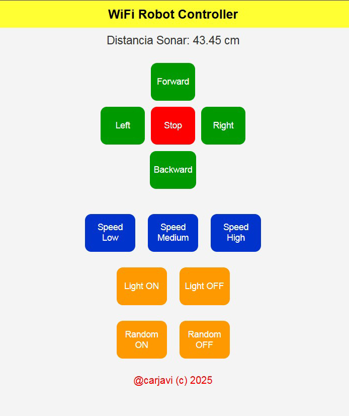

<p align="center"></p>
<h1 align="center"> WiFi-robot-controller </h1> 
<h4 align="right">Jun 25</h4>


<br>

# Table of contents
- [Table of contents](#table-of-contents)
- [Summary](#summary)
  - [Arduino Code](#arduino-code)
- [UI Controller](#ui-controller)
- [Pictures](#pictures)
- [Hardware](#hardware)

<br>

# Summary
Mini robot with Ultrasonic sensor, Ligth, Solar Panel, Wifi controller from static ip 192.168.4.1 ESP8266 as Web Server using WiFi Access Point (AP) mode

## Arduino Code
```c++
/* 
 * ESP8266 as Web Server using WiFi Access Point (AP) mode
 * Connect to AP "Robot Wifi", password = "87654321"
 * Open browser, visit 192.168.4.1
 * Autor: carjavi@hotmail.com
 * Library: arduinoWebSockets
 * Mejorado por ChatGPT
 */

#include <ESP8266WiFi.h>
#include <WiFiClient.h>
#include <ESP8266WebServer.h>
#include <WebSocketsServer.h>
#include <Hash.h>

const char* ssid = "Robot Wifi";
const char* password = "87654321";

const int trigPin = 12;
const int echoPin = 14;
#define SOUND_VELOCITY 0.034
long duration;
float distanceCm;

int PWMA = 5, PWMB = 4, DA = 0, DB = 2;
int Light = 13;
int speedCar = 255;
char Data;
bool randomMode = false;
unsigned long lastCheck = 0;

WebSocketsServer webSocket = WebSocketsServer(81);
ESP8266WebServer server(80);

const char INDEX_HTML[] PROGMEM = R"rawliteral(
<!DOCTYPE html>
<html>
<head>
  <meta name="viewport" content="width=device-width, initial-scale=1">
  <title>WiFi Robot Controller</title>
  <style>
    body { background: #f4f4f4; font-family: Arial; text-align: center; margin: 0; padding: 0; }
    h1 { background: #ff3; margin: 0; padding: 10px; font-size: 20px; }
    .button { width: 80px; height: 60px; margin: 5px; font-size: 14px; border: none; border-radius: 10px; color: #fff; }
    .green { background: #090; } .red { background: #f00; } .blue { background: #03c; } .yellow { background: #f90; }
    .joystick { display: grid; grid-template-columns: 80px 80px 80px; justify-content: center; margin-top: 20px; margin-bottom: 30px; }
    .joystick div { display: flex; justify-content: center; align-items: center; }
    .row { display: flex; justify-content: center; flex-wrap: wrap; gap: 10px; margin-bottom: 15px; }
    .footer { font-size: 16px; color: #f00; margin: 20px;}
    #sonar { font-size: 18px; margin: 10px; color: #333; }
  </style>
  <script>
    var ws;
    function start() {
      ws = new WebSocket('ws://' + location.hostname + ':81/');
      ws.onmessage = function(evt) {
        if(evt.data.startsWith("D")) {
          document.getElementById("sonar").innerText = "Distancia Sonar: " + evt.data.substring(1) + " cm";
        }
      }
    }
    function sendCmd(btn) {
      ws.send(btn.id);
    }
  </script>
</head>
<body onload="start()">
  <h1>WiFi Robot Controller</h1>
  <div id="sonar">Distancia: -- cm</div>

  <!-- Joystick Layout -->
  <div class="joystick">
    <div></div><div><button id="F" class="button green" onclick="sendCmd(this)">Forward</button></div><div></div>
    <div><button id="L" class="button green" onclick="sendCmd(this)">Left</button></div>
    <div><button id="S" class="button red" onclick="sendCmd(this)">Stop</button></div>
    <div><button id="R" class="button green" onclick="sendCmd(this)">Right</button></div>
    <div></div><div><button id="B" class="button green" onclick="sendCmd(this)">Backward</button></div><div></div>
  </div>

  <!-- Speed Row -->
  <div class="row">
    <button id="a" class="button blue" onclick="sendCmd(this)">Speed Low</button>
    <button id="b" class="button blue" onclick="sendCmd(this)">Speed Medium</button>
    <button id="c" class="button blue" onclick="sendCmd(this)">Speed High</button>
  </div>

  <!-- Light Buttons -->
  <div class="row">
    <button id="o" class="button yellow" onclick="sendCmd(this)">Light ON</button>
    <button id="f" class="button yellow" onclick="sendCmd(this)">Light OFF</button>
  </div>

  <!-- Random Buttons -->
  <div class="row">
    <button id="Q" class="button yellow" onclick="sendCmd(this)">Random ON</button>
    <button id="W" class="button yellow" onclick="sendCmd(this)">Random OFF</button>
  </div>

  <div class="footer">@carjavi (c) 2025</div>
</body>
</html>
)rawliteral";


void sendDistance() {
  String msg = "D" + String(distanceCm);
  webSocket.broadcastTXT(msg);
}

void IRAM_ATTR forword() {
  analogWrite(PWMA, speedCar);
  digitalWrite(DA, LOW);
  analogWrite(PWMB, speedCar);
  digitalWrite(DB, LOW);
}

void IRAM_ATTR backword() {
  analogWrite(PWMA, speedCar);
  digitalWrite(DA, HIGH);
  analogWrite(PWMB, speedCar);
  digitalWrite(DB, HIGH);
}

void IRAM_ATTR turnRight() {
  analogWrite(PWMA, speedCar);
  digitalWrite(DA, LOW);
  analogWrite(PWMB, speedCar);
  digitalWrite(DB, HIGH);
}

void IRAM_ATTR turnLeft() {
  analogWrite(PWMA, speedCar);
  digitalWrite(DA, HIGH);
  analogWrite(PWMB, speedCar);
  digitalWrite(DB, LOW);
}

void IRAM_ATTR Stop() {
  digitalWrite(PWMA, LOW);
  digitalWrite(DA, LOW);
  digitalWrite(PWMB, LOW);
  digitalWrite(DB, LOW);
}

void Ramdom_on() {
  if (!randomMode) randomMode = true;
}

void Ramdom_off() {
  randomMode = false;
  Stop();
}

void Sonar() {
  digitalWrite(trigPin, LOW);
  delayMicroseconds(2);
  digitalWrite(trigPin, HIGH);
  delayMicroseconds(10);
  digitalWrite(trigPin, LOW);
  duration = pulseIn(echoPin, HIGH);
  distanceCm = duration * SOUND_VELOCITY / 2;
  sendDistance();
}

void webSocketEvent(uint8_t num, WStype_t type, uint8_t *payload, size_t length) {
  if (type == WStype_TEXT) {
    Data = payload[0];
    switch (Data) {
      case 'a': speedCar = 150; break;
      case 'b': speedCar = 200; break;
      case 'c': speedCar = 255; break;
      case 'o': digitalWrite(Light, HIGH); break;
      case 'f': digitalWrite(Light, LOW); break;
      case 'F': forword(); break;
      case 'B': backword(); break;
      case 'R': turnRight(); break;
      case 'L': turnLeft(); break;
      case 'S': Stop(); break;
      case 'Q': Ramdom_on(); break;
      case 'W': Ramdom_off(); break;
    }
  }
}

void setup() {
  Serial.begin(115200);
  pinMode(trigPin, OUTPUT);
  pinMode(echoPin, INPUT);
  pinMode(PWMA, OUTPUT);
  pinMode(PWMB, OUTPUT);
  pinMode(DA, OUTPUT);
  pinMode(DB, OUTPUT);
  pinMode(Light, OUTPUT);

  WiFi.mode(WIFI_AP);
  WiFi.softAP(ssid, password);

  server.on("/", []() {
    server.send(200, "text/html", String((const char *)INDEX_HTML));
  });

  server.begin();
  webSocket.begin();
  webSocket.onEvent(webSocketEvent);
}

void loop() {
  Sonar();
  if (randomMode) {
    forword();
    if (distanceCm < 15) {
      Stop(); delay(3000); // tiempo que se detiene
      backword(); delay(1000); // tiempo que retrocede
      Stop(); delay(2000); 
      if (random(0, 2) == 0) { // cruza aleatoriamente
        turnRight();
      } else {
        turnLeft();
      }
      delay(500); // tiempo en que cruza
      Stop();
    }
  }
  webSocket.loop();
  server.handleClient();
  delay(100);
}

```

<br>

# UI Controller
<p align="center"></p>

<br>

# Pictures
<p align="center"></p>
<p align="center"></p>
<p align="center"></p>
<p align="center"></p>

# Hardware
<p align="center"></p>
<p align="center"></p>

<br>

---
Copyright &copy; 2022 [carjavi](https://github.com/carjavi). <br>
```www.instintodigital.net``` <br>
carjavi@hotmail.com <br>
<p align="center">
    <a href="https://instintodigital.net/" target="_blank"></a>
</p>
